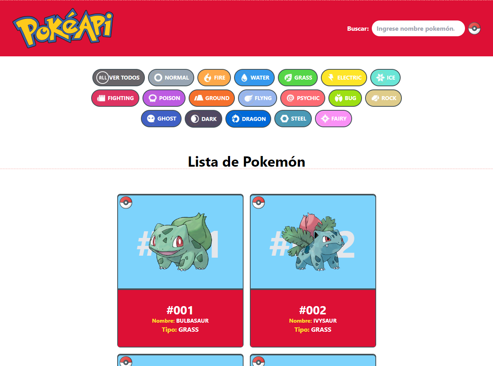
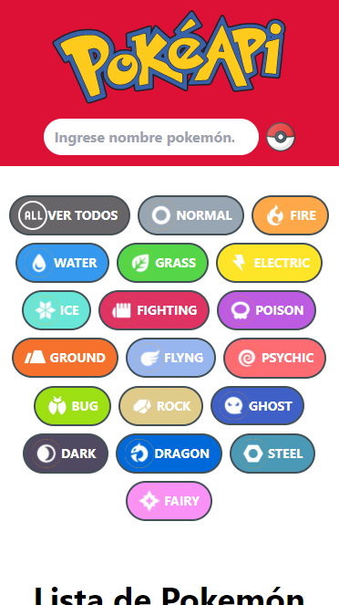

# PROYECTO POKÉDEX JS (PokéAPI) #
---
**Realizado: Jorge Luis Monzón Morales**

El siguient proyecto consiste en consumir la api pokemón https://pokeapi.co/docs/v2#pokemon , mediante el id y poder hacer busquedas masivas, o por nombre o por tipo, contamos con 18 tipos de los 1008 pokemón que podemos filtrar en el siguiente proyecto, por parte de javascript se utilizo Fetch para manipular la solicitudes y se utilizo async/await de esta manera, las solicitudes y la creación de tarjetas se realizarán de manera secuencial, asegurando que las tarjetas se agreguen al contenedor en el orden correcto. Esto puede ayudar a controlar la sincronización y el orden de las operaciones por la parte de html y css se utilizo el framework CSS de Tailwind con sus clases de utilidades, tecnologias aplicadas:

- HTML
- CSS
- JavaScript
- Tailwind CSS
- servicio a consumir(https://pokeapi.co/docs/v2#pokemon)

**Modo Escritorio**
---

**modo Tablet**
---

**Modo celular**
---

**Filtro busqueda por Tipo**
---

**Filtro busqueda por Nombre**
---

**Realizado: Jorge Luis Monzón Morales**